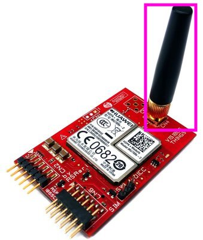
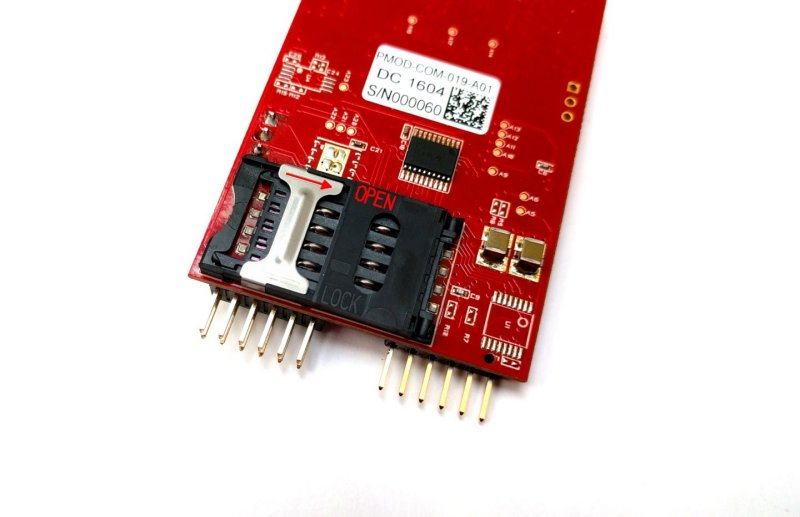
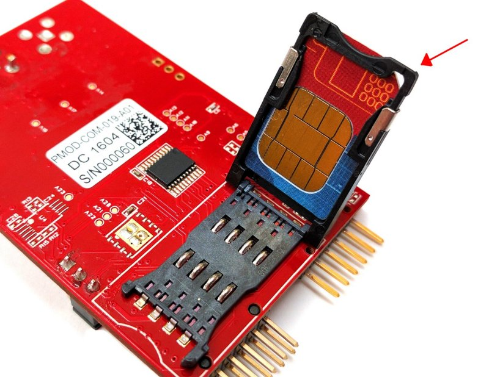
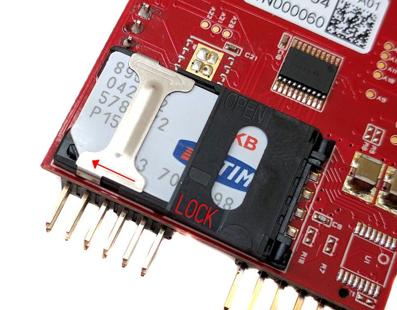
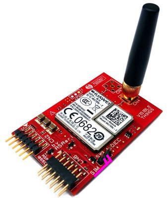
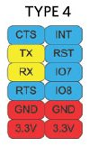
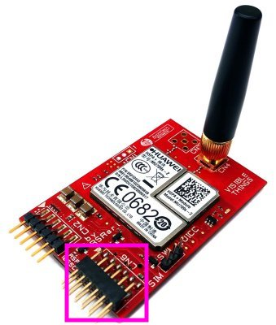

.. index:: qs

.. _quick:

Quick start guide
-----------------

In this guide we used Ubuntu in order to use the PMOD-Huawei board. With the following commands you will be able to navigate on the internet via the PMOD-Huawei. These steps are equal for both version of the boards ME909s and MU709S2.

1. On the PMOD-Huawei board insert the antenna in **CN4** connector

2. Insert your SIM card in the slot located in the bottom layer of the PMOD-Huawei

- Open the slot:

- Insert the SIM in the correct way:

- Close the slot:

3. Insert the jumper from **PIN2** and **PIN3** of the **SW1**

4. Connect board with PMOD interface TYPE 4 to **CN6** connector

The **PIN1** of the **CN6** is signed with a white triangle on the board.

5. In the PMOD-TYPE4 interface are used the line in the following way:

  - CTS: not used (**CN6 PIN1**)
  - TX: used
  - RX: used
  - RTS: not used
  - INT: at startup setted high then setted low only for 1 seconds (**CN6 PIN7**)
  - RST: setted high
  - IO7: not used
  - IO8: not used
  - GND & VCC: used

6. When the **LED1** on the PMOD-Huawei will start to blink steadly every 1 second the module will be connected to the netowrk (feature only for **MU709S2**)

7. We used an device in order to comunicate via UART 3v3 to the pmod interface. For example we used minicom connecting to **/dev/ttyACM0** at baudrate: 115200, 8N1

8. If all works correctly sending the command *AT* the PMOD will reply with *OK*

9. Write this command followed by enter: 

*AT+CGDCONT=1,"IP","YOUR APN"*

Where *"YOUR APN"* is the **Access Point Name** of your SIM

10. Launch this AT command *ATDT*99#* then exit from minicom

11. With the following commands you will be able to navigate on the internet:

 | *sudo pppd ttyACM0 115200 nodetach noauth lock usepeerdns*
 | *sudo route add default ppp0*

12. Open your preferred browser and try to navigate

.. warning::

  remember to disable your wifi connection or LAN connection if they have access to the internet

.. note::

  If you want use Windows, install the right driver using `LPCUSBlib_VirtualSerial.inf <_static/LPCUSBlib_VirtualSerial.inf>`_ file and installing it. In this way you will have the virtual com enabled in order to comunicate with the PMOD.
  In this guide we don't explain how to use the PMOD-Huawei with Windows.

